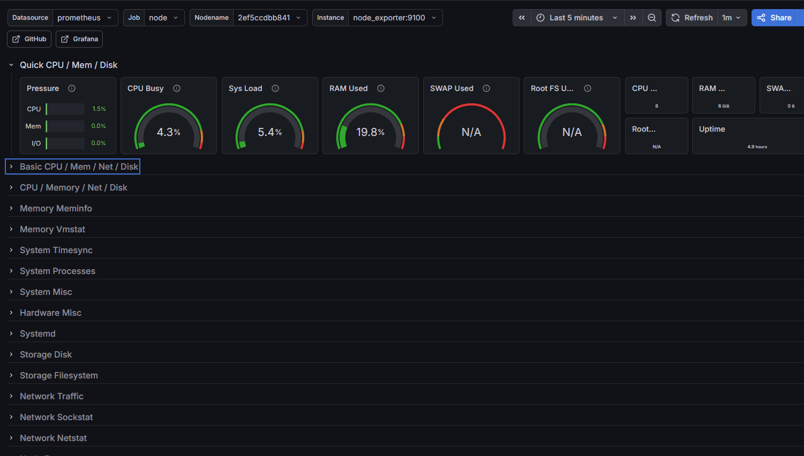
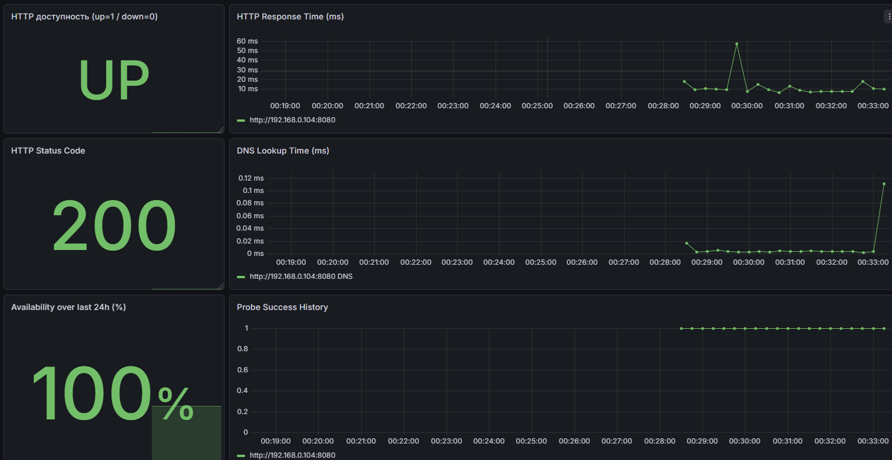

# Домашнее задание
## Формирование dashboard на основе собранных данных с Grafana

Цель:
Сформировать dashboard на основе собранных данных с Grafana


## Описание/Пошаговая инструкция выполнения домашнего задания:
Для выполнения данного ДЗ воспользуйтесь наработками из предыдущего домашнего задания.


На VM с установленным Prometheus установите Grafana последней версии доступной на момент выполнения ДЗ:

Создайте внутри Grafana папки с названиями infra и app;
Внутри директории infra создайте дашборд, который будет отображать сводную информацию по инфраструктуре (CPU, RAM, Network, etc.);
Внутри директории app создайте дашборд, который будет отображать сводную информацию о CMS (доступность компонентов, время ответа, etc.);

Дополните Readme описание действий выполненных в результате выполнения данного ДЗ.

В директорию GAP-2 приложите скриншоты дашбордов которые вы создали.

# Описание выполнения ДЗ
---

### ГРАФАНА ЛЕЖИТ ТУТ
```
db_grafana - БД ГРАФАНЫ
grafana - ГРАФАНА
```
Взял стандартные дашборды 1806 

Для проверки веб приложения буду по стандарту использовать БЛЕКБОКС (ВЕб приложение DVWA по Ip АДРЕССУ 192.168.0.104:8080)

```
🔴 [CRITICAL] SiteDown

Instance: http://192.168.0.104:8080
Job:      blackbox
Summary:  Site DOWN: http://192.168.0.104:8080
Description: HTTP probe failed на http://192.168.0.104:8080
Started:  2026-05-05 21:44:19
```

## Скриншоты дашбордов

### Дашборд инфраструктуры (infra)


### Дашборд приложения (app)
