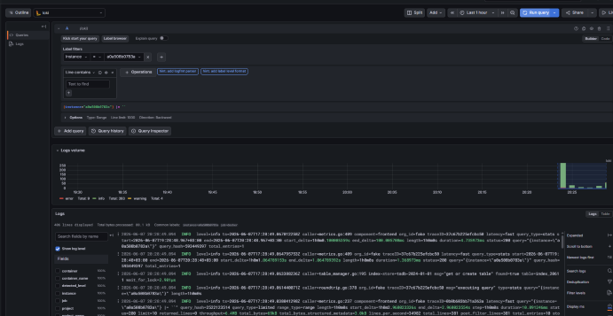

# Домашнее задание
## Построение системы централизованного логирования на основе Opensearch

# Цель:

Заменить Elasticsearch на Grafana Loki.

Описание/Пошаговая инструкция выполнения домашнего задания:
В данном ДЗ вы можете воспользоваться наработками из предыдущего.

В данном ДЗ вам предстоит заменить Elasticsearch на Grafana Loki. Убедитесь, что данные поступают в Grafana Loki и к ним есть доступ.

В качестве результата ДЗ принимаются - файл конфигурации Grafana Loki, файл конфигурации шиппера логов (любой шиппер на ваш выбор), скриншот, в котором видно, что вы получили доступ к логам в Grafana Loki.

# Описание выполнения ДЗ
---

в качсетве отправки логов взял аллой другим компосом ./alloy/

