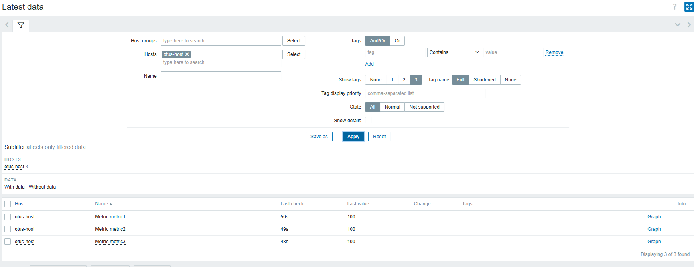
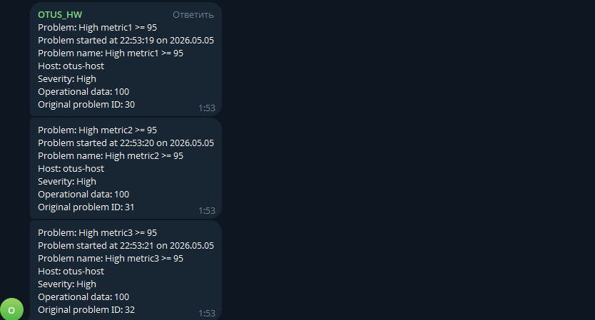

# Домашнее задание
## Настройка zabbix, создание LLD, оповещение на основе триггеров

Цель:
Установить и настроить zabbix, настроить автоматическую отправку аллертов в телеграмм канал.

## Описание/Пошаговая инструкция выполнения домашнего задания:
Необходимо сформировать скрипт генерирующий метрики формата:

otus_important_metrics[metric1]
otus_important_metrics[metric2]
otus_important_metrics[metric3]

С рандомным значение от 0 до 100

Создать правила LLD для обнаружения этих метрик и автоматического добавления триггеров. Триггер должен срабатывать тогда, когда значение больше или равно 95.

Реализовать автоматическую отправку уведомлений в телеграмм канал.

В качестве результаты выполнения ДЗ необходимо предоставить скрипт генерации метрик,
скриншоты графиков полученных метрик, ссылку на телеграмм канал с уже отпраленными уведомлениями.

# Описание выполнения ДЗ
---

из-за некоторых проблем с тг отключил рандом и выставил фактическое значение в 100

1. https://t.me/+xkW59y93YVQxYWMy

## Скриншоты

### Дашборд

### Сообщения
