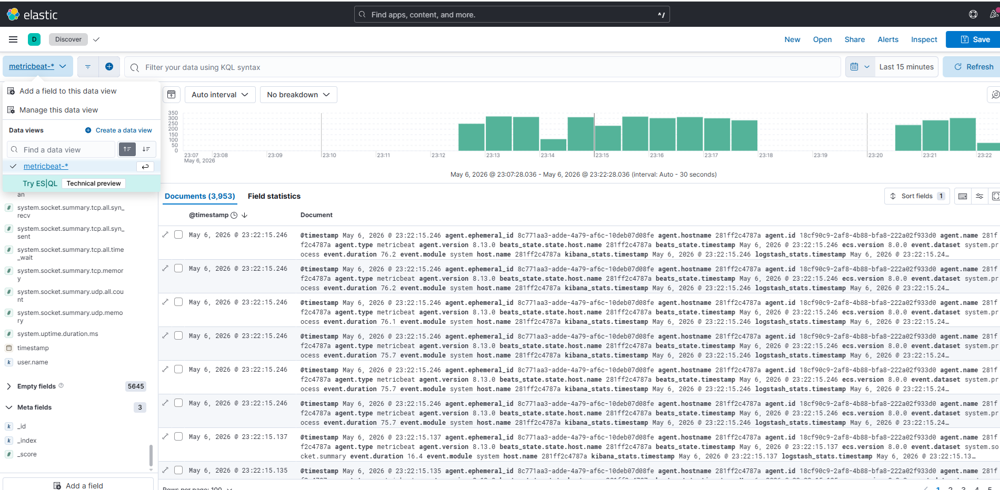

# Домашнее задание
## Установка и настройка отправки данных с помощью Beats

Цель:
Научиться отправлять логи, метрики с помощью beats в elasticsearch.

## Описание/Пошаговая инструкция выполнения домашнего задания:
Для успешного выполнения дз вам нужно сконфигурировать hearthbeat, filebeat и metricbeat на отправку данных в elasticsearch:

На виртуальной машине установите любую open source CMS, которая включает в себя следующие компоненты: nginx, php-fpm, database (MySQL or Postgresql). Можно взять из предыдущих заданий;
На этой же VM установите filebeat и metricbeat. Filebeat должен собирать логи nginx, php-fpm и базы данных. Metricbeat должен собирать метрики VM, nginx, базы данных;
Установите на второй VM Elasticsearch и kibana, а также heartbeat;
Heartbeat должен проверять доступность следующих ресурсов: веб адрес вашей CMS и порта БД

В качестве результата создайте репозиторий приложите конфиги hearthbeat, filebeat и metricbeat.

Приложите скриншот полученных данных отображенных в Kibana.

# Описание выполнения ДЗ
---

В связи с трудностями по ресурсам все работает на одной машине

## Скриншоты

