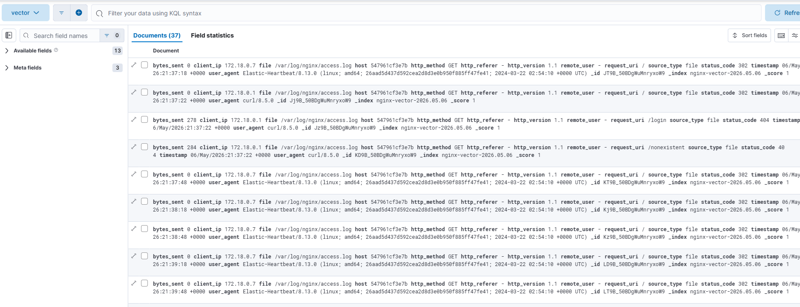
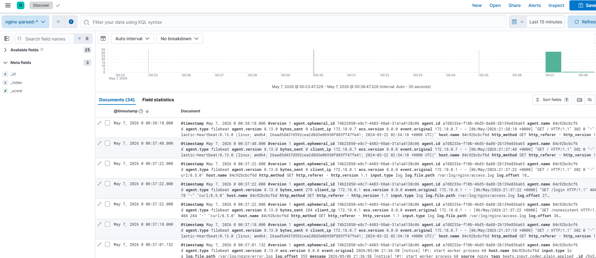

# Домашнее задание
## Преобразование входящих сообщений с помощью Logstash и Vector

Цель:
Установить и настроить Logstash и Vector таким образом, чтобы происходил парсинг входящих сообщений.

## Описание/Пошаговая инструкция выполнения домашнего задания:
Используйте тот же стенд из 2х VM как в предыдущем задании:

Установите Logstash на виртуальную машину с Elasticsearch. Перенастройте отправку логов в него. В Logstash добавьте парсинг логов при помощи grok фильтр (Filebeat пусть при этом шлет сырые данные).
Вместо Logstash установите и настройке Vector с аналогичным парсингом логов при помощи VRL.

# Описание выполнения ДЗ
---

В связи с трудностями по ресурсам все работает на одной машине

Комментарии в докер компос (на отключение 1-го из контейнеров)

## Скриншоты

### VECTOR

### Logstash
