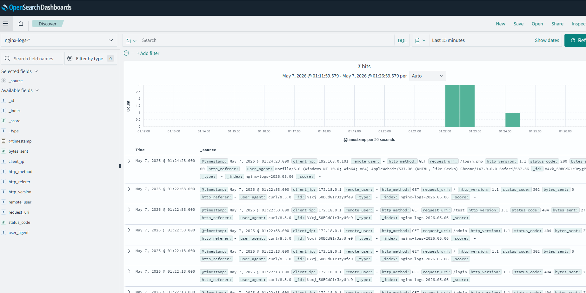

# Домашнее задание
## Построение системы централизованного логирования на основе Opensearch

Цель:
Cообщения сохраняются в базу Opensearch и могут быть визуализированы через Opensearch Dashboard.

В ДЗ тренируются навыки:

навыки работы с fluentbeat;
навыки работы с datapreper;
навыки работы с opensearch.

Описание/Пошаговая инструкция выполнения домашнего задания:
Возьмите за основу стенд из занятий по Elasticstack:

Замените filebeat на fluentbeat с аналогичной конфигурацией;
Замените logstash на datapreper он должен принимать данные от fluentbeat;
Замените Elasticsearch и Kibana на Opensearch и Opensearch Dashboard.

В качестве результата предоставте примеры конфигурации fluentbit, datapreper и скриншоты с Opensearch Dashboard с выводом данных.

# Описание выполнения ДЗ
---

## Скриншоты

