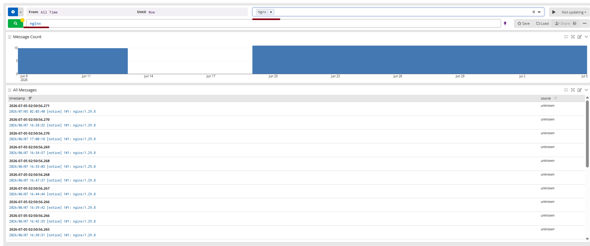

# Домашнее задание
## Построение системы централизованного логирования на основе Opensearch

# Цель:
Научиться принимать логи в graylog и создавать на их основы стримы.

# Описание/Пошаговая инструкция выполнения домашнего задания:
# Для успешного выполнения ДЗ вам нужно сконфигурировать Graylog и отправку логов в него

На виртуальной машине установите любую open source CMS, которая включает в себя следующие компоненты: nginx, php-fpm, database (MySQL or Postgresql). Можно взять из предыдущих заданий;
На этой же VM установите graylog sidecar.
Установите на второй VM Graylog (server, opensearch, mongodb) и datapreper
Подключите установленный sidecar в graylog и настройте сбор и отправку логов nginx, php-fpm и базы данных, используя sidecar.
Разделите логи в разные стримы.

# Описание выполнения ДЗ
---

В связи с трудностями по ресурсам все работает на одной машине
Так же был даунгрейд версий из-за слабого железа и доп парметры по урезке (из-за места)

## Скриншоты

сайдкар ставил отдельно на хост

